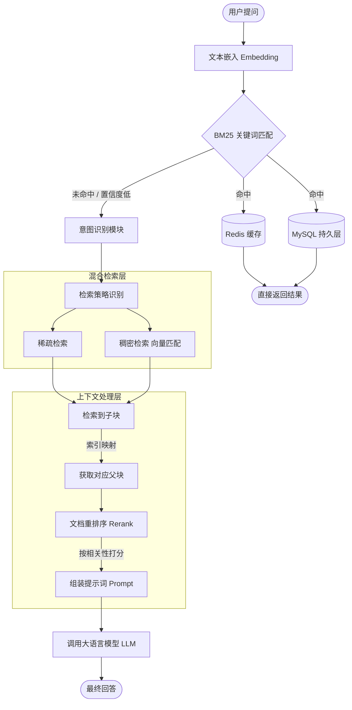

# FA-ops-rag
## 项目简介

用于辅助软件系统生产环境一/二线运维进行问题定位与修复开发，提升问题单处理效率减少管理升级次数，基于问题案例整理与系统架构文档作为数据源的RAG系统。
文档加载使用先切分为父子块，分别存入向量库与关系型数据库，子块用于检索，父块用于生成方式提升系统运行效率。
检索方面先用BM25进行数据库文档检索，后使用稠密/稀疏混合检索向量方式做到关键字与语义检索的优势互补，同时实现对请求的递进处理，尽可能用较小成本完成回答。

## 技术栈
Python + LangChain + Milvus + Redis + Mysql + RAGAS...

### 用到的本地模型：

**bert-base-chinese**：作为预训练模型，经过业务数据微调用于意图识别

**bge-reranker-large**：用于文档的重排序

**BGE-M3**：用与文档与查询内容的词嵌入

**nlp_bert_document-segmentation_chinese-base**：用于进行基于语义进行文档切割，可通过参数调整是否使用

### 调试时使用的外部调用模型：

**qwen3.7-plus**：用于检索策略的识别、使用提示词模板的选择、结合文档内容进行答案生成等。

## 核心功能

##### 1. 智能知识检索与问答

**多源异构数据解析**：支持对运维手册、历史故障工单、SOP（标准作业程序）等复杂格式（PDF、Word、表格）进行解析与结构化处理，构建专属运维向量知识库。

**精准语义检索**：基于自然语言提问，快速召回最相关的运维知识片段，解决传统关键词搜索无法匹配模糊故障描述的问题。

**溯源与引用**：生成的回答严格基于检索到的真实文档，并附带原文引用链接，确保运维建议有据可查，降低大模型“幻觉”风险。

##### 2. 复杂故障推理与根因分析

**多跳逻辑推理**：突破传统 RAG 仅能进行“文档问答”的局限，支持跨文档、多步骤的故障链路推导（例如：从“网络延迟”推导到“交换机端口配置错误”）。

**主动追问机制**：当用户提供的故障信息不足时，系统能模拟资深专家，主动追问关键排查指标（如 CPU 负载、错误日志等），逐步缩小故障范围。

**结构化数据联动**：可进行定制化开发打通企业监控平台，结合实时告警和历史工单数据进行交叉验证，提升诊断准确率。

## 架构设计

  
## 快速体验
待更新
## 预计的迭代内容

#### 运维知识图谱增强能力（GraphRAG）

**实体与关系抽取**：利用大模型自动从非结构化文档中提取“设备-故障-原因-解决方案”等实体及因果关系，构建运维领域知识图谱。
**图谱与向量混合检索**：采用 GraphRAG 架构，结合向量检索的“广度”与知识图谱的“深度”，专门解决跨工序、跨时间的复杂根因溯源问题。

#### 动态知识更新与工程化落地

**增量知识更新**：支持运维文档的增量解析与向量库动态更新，确保系统掌握最新的故障处理经验，无需频繁全量重建。

**私有术语适配**：针对企业内部特定的缩写、黑话或专有名词，通过微调或外挂词表机制，提升模型对内部业务的理解能力。

**安全与权限隔离**：支持私有化部署或本地知识库隔离，确保敏感的运维数据不出域，满足企业级安全合规要求。